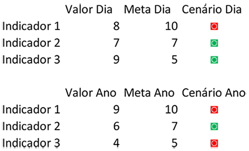
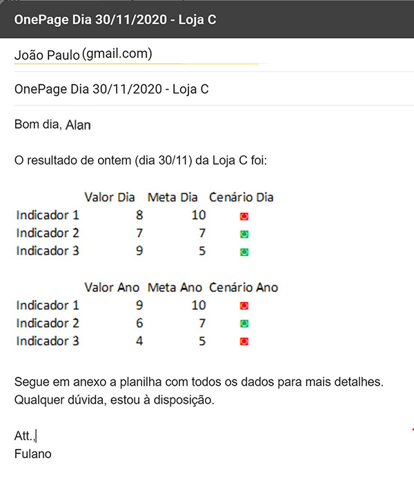

<h1 align="center"> Automação de Indicadores </h1>
<h4 align="center">Objetivo: Treinar e criar um Projeto Completo que envolva a automatização de um processo feito no computador.</h4>

   

### :rocket:  Tecnologias

------------
Esse projeto foi desenvolvido como um Projeto Pessoal, com as seguintes tecnologias:

- [Python](https://www.python.org/ "Heading link")
- [Pandas](https://pandas.pydata.org/ "Heading link")
- [Pywin32](https://pypi.org/project/pywin32/ "Heading link")

### :information_source:  Como Usar
------------
Para executar este aplicativo, você precisará apenas clonar e abrir em seu navegador. 

Da sua linha de comando:

    # Clone este repositório
    $ git clone https://github.com/correaito/automacao_processo.git
    
    # Vá para o repositório
    $ cd automacao_processo
    
    # Instale as extensões
    $ pip install pandas
    $ pip install openpyxl
    $ pip install pywin32

    
Agora, para executar o script, dentro do PyCharm, abra o arquivo main.py, clique com o botão direito do mouse, e depois em "Run main.py", ou com <kbd>SHIFT</kbd> + <kbd>CTRL</kbd> + <kbd>F10</kbd>.

### :clipboard:  Descrição

Imagine que você trabalha em uma grande rede de lojas de roupa com 25 lojas espalhadas por todo o Brasil.

Todo dia, pela manhã, a equipe de análise de dados calcula os chamados One Pages e envia para o gerente de cada loja o OnePage da sua loja, bem como todas as informações usadas no cálculo dos indicadores.

Um One Page é um resumo muito simples e direto ao ponto, usado pela equipe de gerência de loja para saber os principais indicadores de cada loja e permitir em 1 página (daí o nome OnePage) tanto a comparação entre diferentes lojas, quanto quais indicadores aquela loja conseguiu cumprir naquele dia ou não.

Exemplo de OnePage:

Do Analista de Dados é demandado criar um processo da forma mais automática possível para calcular o OnePage de cada loja e enviar um email para o gerente de cada loja com o seu OnePage no corpo do e-mail e também o arquivo completo com os dados da sua respectiva loja em anexo.

Ex: O e-mail a ser enviado para o Gerente da Loja A deve ser como exemplo

### :page_with_curl:  Arquivos e Informações Importantes

- Arquivo Emails.xlsx com o nome, a loja e o e-mail de cada gerente. Obs: Sugiro substituir a coluna de e-mail de cada gerente por um e-mail seu, para você poder testar o resultado

- Arquivo Vendas.xlsx com as vendas de todas as lojas. Obs: Cada gerente só deve receber o OnePage e um arquivo em excel em anexo com as vendas da sua loja. As informações de outra loja não devem ser enviados ao gerente que não é daquela loja.

- Arquivo Lojas.csv com o nome de cada Loja

- Ao final, sua rotina deve enviar ainda um e-mail para a diretoria (informações também estão no arquivo Emails.xlsx) com 2 rankings das lojas em anexo, 1 ranking do dia e outro ranking anual. Além disso, no corpo do e-mail, deve ressaltar qual foi a melhor e a pior loja do dia e também a melhor e pior loja do ano. O ranking de uma loja é dado pelo faturamento da loja.

- As planilhas de cada loja devem ser salvas dentro da pasta da loja com a data da planilha, a fim de criar um histórico de backup

### :chart_with_upwards_trend:  Indicadores do OnePage

- Faturamento -> Meta Ano: 1.650.000 / Meta Dia: 1000
- Diversidade de Produtos (quantos produtos diferentes foram vendidos naquele período) -> Meta Ano: 120 / Meta Dia: 4
- Ticket Médio por Venda -> Meta Ano: 500 / Meta Dia: 500

Obs: Cada indicador deve ser calculado no dia e no ano. O indicador do dia deve ser o do último dia disponível na planilha de Vendas (a data mais recente)

Obs2: Dica para o caracter do sinal verde e vermelho: pegue o caracter desse site (https://fsymbols.com/keyboard/windows/alt-codes/list/) e formate com html